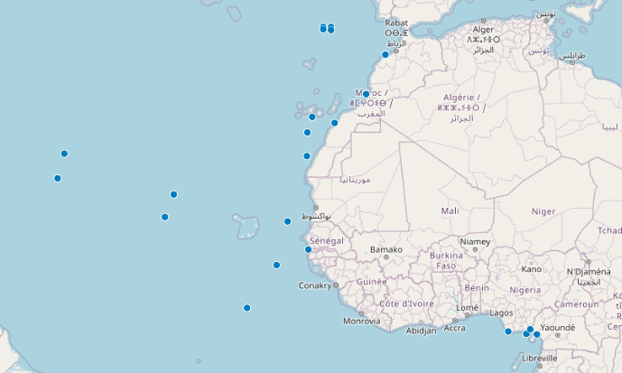
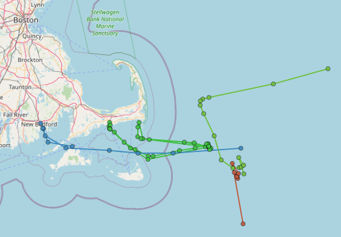
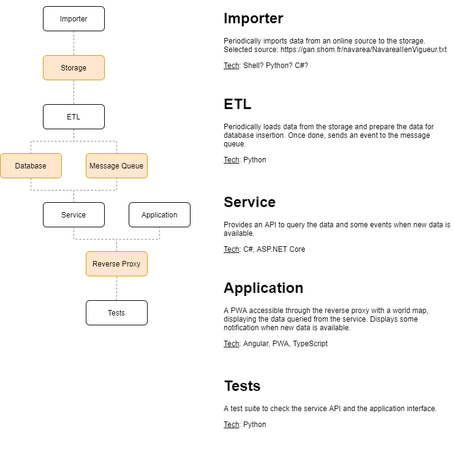

    

# Narwhal

This repository contains a miniature version of the infrastructure we run in OneOcean. We use this repo as a test during our hiring process.

It is a full web application, displaying a world map, and showing points where [Navigational Warning](https://www.ccg-gcc.gc.ca/mcts-sctm/navwarn-avnav-ca-eng.html) from [France](https://gan.shom.fr/diffusion/home) are emitted.

    
    

The goal is to provide a test canvas for any candidate to ask various tasks and questions while staying close enough to our real world needs.
It contains 8 different components, using multiple applications, tools and languages.

This test framework is valid for any technical position, as it includes some infrastructure, web services, front-end application, ETL pipelines and more.

## Structure

- **Narwhal.App**: Web application, built with Angular. It sits behind the reverse proxy and communicates with the service to get information. It displays a world map and some
- **Narwhal.Database**: A MongoDB storage used to store information collected through the ETL pipeline
- **Narwhall.ETL**: A simple ETL pipeline written in Python, reads a text file to extract information and stores it in the database
- **Narwhal.Front**: A reverse proxy sitting in fromt of all web endpoints, similar to a real infrastructure. Any application or service call will go through it. It uses Nginx
- **Narwhal.Importer**: A Powershell script used to import the text based file for processing using the ETL pipeline
- **Narwhal.Messaging**: A MQTT server (mosquitto) used to notify the service, and the application when new data is available
- **Narwhal.Service**: An ASP.NET Core web service written in C#. It exposes the database information and reacts when new data is available
- **Narwhal.Tests**: A test suite for this application, writte in Python

Two scripts are available inside of every service directory:
- **start_local.bat**: A batch used to quickly start the corresponding service locally on your machine
- **start_docker.bat**: A batch used to build a Docker image and run it on your machine

Scripts with the same name are available in the root directory to run the full service stack at once. Please note that the root **start_docker.bat** script will use Docker Compose.

    

## Requirements

You will be able to run all the services only using Docker on your machine.
As mentionned, we also provide a **docker-compose.yml** file.

To develop on this application locally, you will need:
- **Powershell** to run **Narwhal.Importer**
- **Python 3+** to run **Narwhal.ETL** and **Narwhal.Tests**
- **.NET Core 3.1** to run **Narwhal.Service**
- **NodeJS 12+** to run **Narwhal.App**

Even though the scripts are only provided in .bat files, the services should not be platform dependent and should be usable on Linux or Mac.

## Quick start guide

> If you have Docker and Docker Compose on your machine, just run **start_docker.bat** in the root diretory to get everything running. If you don't have it installed or if you want to work on the solution, please follow the steps below.

First, make sure you have all the requirements from the above paragraph installed properly.

You should now be able to run the **start_local.bat** in the root directory of Narwhal. It will create 5 console windows (**Narwhal.Database**, **Narwhal.Messaging**, **Narwhal.Service**, **Narwhal.App**, **Narwhal.Front**).
Go grab a coffee as the Angular App will need some time to build.

When the build is over, you should be able to hit http://127.0.0.1 in your browser and see an empty map, as the database is empty.

Then, you can start **Narwhal.Importer** by running its own **start_local.bat**, it will import data to the **Playground/Storage** directory.
Last step, you can start **Narwhal.ETL** by running its own **start_local.bat**, it will process the data previously downloaded and insert it in the database.

By refreshing your browser, you should be able to see some points on the map.

## FAQ

### I get some error with ports not available / already allocated

Below is the list of used ports. Work needs to be done in order to modify the ports easily.
- **Narwhal.Database** on port 27017
- **Narwhal.Messaging** on port 1883
- **Narwhal.App** on port 6162
- **Narwhal.Service** on port 6161
- **Narwhal.Front** on port 80

### X was not found / Node asks me to update the version

- Make sure all the dependencies are up to date, refer to the Requirements block above

## Attribution

- Icon by [Freepik](https://www.flaticon.com/authors/freepik) from [flaticon.com](https://www.flaticon.com/)
- MongoDB downloaded from [mongodb.com](https://www.mongodb.com/try/download/community)
- Nginx downloaded from [nginx.org](http://nginx.org/en/download.html)
- Mosquitto downloaded from [mosquitto.org](https://mosquitto.org/download/)
- Fart downloaded from [sourceforge.net/projects/fart-it](https://sourceforge.net/projects/fart-it/)
- Map tiles from [openstreetmap.org](https://www.openstreetmap.org)